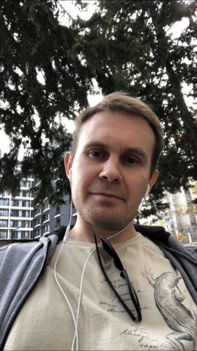

<link rel="stylesheet" href="{{ '/assets/style.css' | relative_url }}">

  

  <b>Senior iOS Engineer</b> 
  Swift • SwiftUI • UIKit • Architecture • CI/CD

  
📍 Lipetsk, Russia (Remote)

  

    📞 <a href="tel:+79202432765">+7 (920) 243-27-65</a>
  

  

    ✉️ <a href="mailto:Lisitsyn.anton.a@gmail.com">Lisitsyn.anton.a@gmail.com</a>
  

  
🇬🇧 English: B2 Upper Intermediate

  <a href="https://github.com/blackfoxik">GitHub</a>

---

## Professional Summary

Senior iOS Engineer with 7+ years of commercial iOS development experience and 17+ years in software engineering. Specialized in Swift, UIKit, SwiftUI, Objective-C, mobile architecture, and CI/CD automation.

Experienced in designing data-driven UI platforms, experimentation frameworks, feature flag systems, and scalable mobile applications from concept to production.

Strong background in Clean Architecture, Dependency Injection, Protocol-Oriented Programming, and cross-functional collaboration across product, backend, design, and QA teams. Experienced in owning delivery pipelines, release processes, and technical decision-making for production mobile applications.

---

# Technical Skills

## Languages

Swift, Objective-C, Dart, Ruby, C#

## iOS

UIKit, SwiftUI, Core Data, AVFoundation, WebRTC, WebSockets, Push Notifications, Deep Linking

## Architecture

Clean Architecture, MVVM, VIPER, Dependency Injection, Protocol-Oriented Programming, Design Patterns, Modular Architecture

## Concurrency & Reactive

Swift Concurrency, Combine, RxSwift, GCD

## Testing

XCTest, Unit Testing

## Networking & Data

REST APIs, WebSockets, Core Data

## CI/CD & DevOps

Fastlane, GitLab CI, GitLab Runner, Xcode Cloud, XcodeGen

## Analytics & Product

AppsFlyer, Firebase, GrowthBook, A/B Testing

## Tools

Git, CocoaPods, Carthage, Swift Package Manager, Figma, Cursor, ChatGPT

---

# Professional Experience

## Viamobi LLC

**Senior iOS Engineer**

**August 2019 – Present**

Designed and implemented a data-driven UI architecture enabling dynamic in-app product experiences and remote feature configuration, significantly increasing flexibility and reducing release dependencies for product teams.

Led modernization of legacy modules while introducing scalable architectural patterns based on Clean Architecture, Dependency Injection, and Protocol-Oriented Programming.

Implemented feature flagging and experimentation infrastructure using GrowthBook, ensuring all new functionality could be safely rolled out, tested, and controlled remotely.

Owned critical application flows including push notifications, deep links, WebView integrations, analytics instrumentation, and user acquisition tracking.

Developed UI using UIKit (XIB, Auto Layout, programmatic UI), SwiftUI, UICollectionViewCompositionalLayout, and NSDiffableDataSourceSnapshot.

Built Flutter-based experimentation screens enabling rapid A/B/C testing and validation of product hypotheses.

Introduced Swift Structured Concurrency for asynchronous workflows, improving code maintainability and reliability.

Contributed to application quality through unit testing and continuous refactoring of critical components.

Owned and maintained iOS CI/CD infrastructure including GitLab CI, GitLab Runner, Fastlane, Xcode Cloud, and Mac Mini build environments.

Acted as a key technical stakeholder, coordinating implementation details across product, backend, design, and QA teams throughout the delivery lifecycle.

Leveraged AI-assisted development tools (ChatGPT and Cursor) to accelerate implementation, refactoring, debugging, and documentation workflows.

### Applications

- RosDolgi
- Government-related financial services products

---

## EcoDomus LLC

**iOS Engineer**

**January 2018 – August 2019**

### Perekrestok Delivery App (X5 Retail Group)

Owned key areas of a large-scale grocery delivery application, including architectural decisions, technology selection, and long-term system evolution.

Delivered and maintained core product functionality in a high-traffic production environment while continuously improving stability, performance, and maintainability.

Contributed to engineering standards and codebase modernization efforts across the mobile team.

### EcoDomus Mobile

Developed and maintained an enterprise BIM-based mobile platform (Unity + Objective-C) used for construction and facility management workflows.

Expanded platform support from iPad-only deployment to universal iPhone support, improving accessibility for field personnel.

Implemented and maintained features supporting inspections, maintenance tracking, document management, and COBie-based operational workflows.

### Confectionery Customer Application (Kazakhstan)

Delivered a customer-facing mobile application from initial architecture through App Store release.

Implemented loyalty functionality including QR-code-based bonus management, geolocation-driven store discovery, promotions, news feeds, and customer support chat.

Owned full application lifecycle including architecture, implementation, release, and production support.

---

## It's Time LLC

**iOS Engineer**

**August 2017 – December 2017**

Developed an iOS telepresence platform from concept through Enterprise distribution release.

Designed and implemented real-time robot control functionality using WebSockets alongside live audio and video communication powered by WebRTC.

Owned application architecture, technology selection, and implementation of latency-sensitive communication workflows.

### Technologies

Swift, UIKit, Core Data, WebRTC, WebSockets, AVFoundation, Alamofire, AFNetworking, MVVM, CocoaPods, Git.

---

## OS Agent

**Ruby on Rails Developer**

**August 2013 – January 2017**

Developed and maintained commercial web applications, e-commerce solutions, discount systems, CMS migrations, and business automation integrations for multiple clients.

Implemented data migration solutions, loyalty systems, and custom business workflows supporting production operations.

---

## Cherkizovo Group

**.NET Developer**

**June 2012 – August 2013**

Developed enterprise software solutions for logistics and document management systems, including applications for portable data terminals and Windows-based business platforms.

Implemented push notification functionality for Windows RT applications and contributed to workflow automation projects.

---

## Lipetsk Passenger Transport

**Software Engineer / Deputy Head of Technical Information Department**

**October 2009 – March 2012**

Designed and developed internal systems for fuel consumption monitoring, operational reporting, and task management automation.

---

## Moscow State University of Economics, Statistics and Informatics

**Lecturer and Research Laboratory Member**

**September 2008 – October 2009**

Taught corporate information systems design and participated in development of software solutions for university information kiosks.

---

# Education

## Voronezh State Technical University

**Engineer Degree in Information Technologies**

2008

---

# Professional Development

- Stanford University — Developing iOS Apps with Swift (CS193P)
- Stanford University — Programming Abstractions (CS106B)
- Stanford University — Programming Methodology (CS106A)
- Multiple English language programs and ongoing communication practice with native speakers

---

# Languages

- Russian — Native
- English — B2 Upper Intermediate
